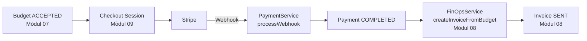

# Mòdul 09: Payments — Cobraments amb Stripe

> **Versió:** 1.0
> **Data:** 2026-05-13
> **Dependències:** Mòdul 01 (Auth), Mòdul 07 (Billing), Mòdul 08 (FinOps)

---

## 1. Objectius

- Crear **Checkout Sessions de Stripe** perquè els clients puguin pagar els **pressupostos de setup** acceptats (pagament únic)
- Gestionar el cicle de vida del pagament: pendent → completat → fallit → reemborsat
- Sincronitzar estats de pagament entre Stripe i la plataforma via **webhooks**
- Crear la factura a Holded (Mòdul 08) automàticament quan el pagament es completa
- La integració ha de ser **mockejable** per desenvolupament sense compte Stripe

> **Àmbit clar:** Stripe gestiona **únicament** els pagaments de setup (un sol cop per pressupost). Les **quotes mensuals recurrents** es cobren via **domiciliació SEPA** (Mòdul 08 FinOps), NO via Stripe. Això evita comissions de Stripe (~0.40€) en transaccions petites de 10€/mes.

---

## 2. Abast

### 2.1 Funcionalitats incloses

- **StripeClient** (Interface + Mock + Real): Abstracció per cridar l'API de Stripe
- **Checkout Session**: Generar enllaç de pagament per a un pressupost acceptat
- **Webhook Stripe**: Rebre notificacions de pagament completat i fallit
- **Integració amb Billing**: Quan Budget passa a ACCEPTED, es crea el checkout
- **Integració amb FinOps**: Quan Stripe confirma el pagament, es crea la factura a Holded
- **Reemborsaments**: Anul·lar pagament des de la plataforma (cancel·la a Stripe + Holded)
- **Dashboard de pagaments**: Resum de pagaments per tenant (completats, pendents, fallits)

### 2.2 Funcionalitats excloses

- Targetes guardades / customers reutilitzables (es podria afegir després)
- **Subscripcions recurrents via Stripe** — les quotes mensuals van per SEPA (Mòdul 08), NO per Stripe
- Més d'un intent de pagament per pressupost
- Cancel·lació del checkout per part del client (Stripe ho gestiona)

### 2.3 Actors

| Actor | Descripció | Permisos |
|-------|-----------|----------|
| SUPER_ADMIN | Configuració de Stripe (API Key, webhook secret) | Accés complet a Payments |
| ADMIN | Veure pagaments del seu tenant | Veure pagaments |
| CLIENT | Pagar el seu pressupost a través de Stripe | Pagar (via enllaç), veure rebut |
| Visitant | Públic (sense JWT) | Pagar via Checkout Session (enllaç públic) |

---

## 3. Model de dades

### 3.1 Entitats (PostgreSQL)

#### StripeConfig

Configuració de Stripe per tenant (o global per a la plataforma).

| Camp | Tipus | Mapeig JPA | Descripció |
|------|-------|-----------|------------|
| id | UUID | @Id @GeneratedValue | |
| tenantId | UUID | @Column(nullable=false, unique=true) | FK a Tenant (null = configuració global) |
| apiKeyRef | String(100) | @Column(nullable=false) | Referència al Vault (secret key Stripe) |
| webhookSecret | String(100) | @Column | Secret per verificar webhooks |
| isActive | Boolean | @Column(nullable=false) | Si la integració està activa |
| createdAt | Instant | @CreatedDate | |
| updatedAt | Instant | @LastModifiedDate | |

#### Payment

Pagament creat a Stripe des de la plataforma.

| Camp | Tipus | Mapeig JPA | Descripció |
|------|-------|-----------|------------|
| id | UUID | @Id @GeneratedValue | |
| tenantId | UUID | @Column(nullable=false) | FK a Tenant |
| budgetId | UUID | @Column(nullable=false, unique=true) | FK a Budget (1 pagament per pressupost) |
| invoiceId | UUID | @Column | FK a Invoice (Mòdul 08) creada després del pagament |
| stripeSessionId | String(100) | @Column(unique=true) | ID de la Checkout Session a Stripe |
| stripePaymentIntentId | String(100) | @Column(unique=true) | ID del PaymentIntent a Stripe |
| amount | BigDecimal | @Column(nullable=false) | Import total |
| currency | String(3) | @Column(length=3) | EUR |
| status | PaymentStatus | @Enumerated(STRING) | PENDING, COMPLETED, FAILED, REFUNDED |
| checkoutUrl | String(500) | @Column | URL de la Checkout Session |
| paidAt | Instant | @Column | Data de cobrament |
| refundedAt | Instant | @Column | Data de reemborsament |
| errorMessage | String(500) | @Column | Missatge d'error si falla |
| isActive | Boolean | @Column(nullable=false) | |
| createdAt | Instant | @CreatedDate | |
| updatedAt | Instant | @LastModifiedDate | |

### 3.2 Enums

```java
public enum PaymentStatus {
    PENDING,    // Checkout creat, pendent de pagament
    COMPLETED,  // Pagament completat amb èxit
    FAILED,     // Pagament fallit
    REFUNDED    // Reemborsat
}
```

---

## 4. Endpoints API

Tots els endpoints porten prefix `/api/v1/payments`. Tots requereixen JWT + autenticació, excepte el webhook.

| Mètode | Ruta | @PreAuthorize | Descripció |
|--------|------|--------------|-----------|
| POST | /api/v1/payments/configure | SUPER_ADMIN | Configurar Stripe (API Key) |
| GET | /api/v1/payments/configure/{tenantId} | SUPER_ADMIN, ADMIN | Veure configuració Stripe del tenant |
| POST | /api/v1/payments/budgets/{budgetId}/checkout | SUPER_ADMIN, ADMIN | Crear Checkout Session per a un pressupost |
| GET | /api/v1/payments | SUPER_ADMIN, ADMIN | Llistar pagaments (paginat, filtre per tenant/estat) |
| GET | /api/v1/payments/{paymentId} | isAuthenticated() | Detall del pagament (CLIENT només els seus) |
| GET | /api/v1/payments/{paymentId}/receipt | isAuthenticated() | URL del rebut a Stripe |
| POST | /api/v1/payments/{paymentId}/refund | SUPER_ADMIN, ADMIN | Reemborsar pagament |
| GET | /api/v1/payments/dashboard | SUPER_ADMIN, ADMIN | Dashboard de pagaments del tenant |
| POST | /api/v1/payments/webhook | CAP (públic, signat per Stripe) | Webhook de Stripe |

### Flux automàtic (no endpoint directe)

Quan Stripe envia `checkout.session.completed` via webhook:
1. Stripe verifica la signatura HMAC-SHA256
2. Es busca el Payment per `stripeSessionId`
3. Es canvia Payment.status a COMPLETED
4. Es crea la Invoice a la BD (Mòdul 08) via `FinOpsService.createInvoiceFromBudget()`
5. Si falla, es guarda l'error al Payment

---

## 5. Serveis

### 5.1 StripeClient (Interface)

```java
public interface StripeClient {
    String createCheckoutSession(UUID budgetId, BigDecimal amount, String currency,
                                  String successUrl, String cancelUrl);
    PaymentStatus checkPaymentStatus(String stripeSessionId);
    String getReceiptUrl(String paymentIntentId);
    void refundPayment(String paymentIntentId);
    boolean isConnected();
}
```

### 5.2 Implementacions

- **StripeMockClient**: Retorna dades falses (checkout URL = `https://mock.stripe.com/checkout/xxx`, status = COMPLETED)
- **StripeRealClient**: Utilitza `com.stripe:stripe-java` per cridar l'API real de Stripe

### 5.3 PaymentService

```java
public interface PaymentService {
    // Configuració
    void configure(StripeConfigRequest request);
    StripeConfig getConfig(UUID tenantId);

    // Checkout
    PaymentResponse createCheckoutSession(UUID budgetId);
    PaymentResponse getPayment(UUID paymentId, UUID currentTenantId);
    String getReceiptUrl(UUID paymentId, UUID currentTenantId);

    // Gestió
    Page<PaymentResponse> listPayments(UUID tenantId, String status, int page, int size);
    PaymentResponse refundPayment(UUID paymentId);

    // Dashboard
    PaymentDashboardResponse getDashboard(UUID tenantId);

    // Webhook
    WebhookResponse processWebhook(String payload, String signatureHeader);
}
```

### 5.4 PaymentOrchestrator

Implementació `@Service` principal que:
- Injecció de `StripeClient` (mock o real segons perfil)
- Creació de Checkout Sessions: Budget → Payment (PENDING) → Stripe → checkoutUrl
- Reemborsaments: Payment → Stripe.refund → Payment (REFUNDED)
- Processament de webhooks amb verificació de signatura

---

## 6. Integració amb Stripe

### 6.1 API Stripe

- Base URL: `https://api.stripe.com`
- SDK Java: `com.stripe:stripe-java` (Maven)
- Autenticació: Secret Key via `Stripe.apiKey = "sk_test_..."`

### 6.2 Flux de pagament complet

```
1. ADMIN crea Checkout Session → POST /api/v1/payments/budgets/{id}/checkout
2. Sistema:
   a. Crea Payment (PENDING) a la BD
   b. StripeClient.createCheckoutSession() → Stripe crea sessió
   c. Retorna checkoutUrl al client
3. ADMIN envia l'enllaç al CLIENT
4. CLIENT paga a Stripe Checkout (hostatjat per Stripe)
5. Stripe envia webhook checkout.session.completed
6. Sistema:
   a. Verifica signatura
   b. Busca Payment per stripeSessionId
   c. Canvia Payment.status → COMPLETED
   d. Crida FinOpsService.createInvoiceFromBudget() → Invoice (Mòdul 08)
   e. Assigna invoiceId al Payment
7. CLIENT/ADMIN veu el pagament com a COMPLETED + factura disponible
```

### 6.3 Checkout Session (Stripe API)

Paràmetres de creació:

```json
{
  "mode": "payment",
  "success_url": "https://portal.amg.cat/payments/success?session_id={CHECKOUT_SESSION_ID}",
  "cancel_url": "https://portal.amg.cat/payments/cancel",
  "line_items": [{
    "price_data": {
      "currency": "eur",
      "product_data": {
        "name": "Pressupost AMG - {budgetNumber}",
        "description": "Serveis de digitalització"
      },
      "unit_amount": 15000
    },
    "quantity": 1
  }],
  "metadata": {
    "budgetId": "uuid-del-budget",
    "tenantId": "uuid-del-tenant"
  },
  "locale": "ca"
}
```

### 6.4 Webhook Stripe

- Events a escoltar: `checkout.session.completed`, `checkout.session.expired`
- Verificació: HMAC-SHA256 amb `webhookSecret`
- Endpoint: `POST /api/v1/payments/webhook` (públic, sense JWT)

---

## 7. Seguretat

- La **Secret Key de Stripe** s'emmagatzema xifrada al Vault (Mòdul 02)
- El webhook de Stripe porta signatura HMAC-SHA256 (no JWT)
- CLIENT només pot veure els seus pagaments
- CLIENT NO pot crear checkouts ni reemborsar
- Checkout URL: retorna 200 amb l'enllaç (no redirect automàtic)

---

## 8. Configuració

### application.yml

```yaml
app:
  payments:
    provider: mock          # mock | stripe
    stripe:
      api-key-ref:          # Referència al Vault
      webhook-secret: ${STRIPE_WEBHOOK_SECRET}
    success-url: https://portal.amg.cat/payments/success
    cancel-url: https://portal.amg.cat/payments/cancel
```

### Perfils

- **dev**: `app.payments.provider=mock` (no cal compte Stripe)
- **prod**: `app.payments.provider=stripe` (requereix compte Stripe + API Key)

---

## 9. Dependències Maven (noves)

```xml
<dependency>
    <groupId>com.stripe</groupId>
    <artifactId>stripe-java</artifactId>
    <version>28.4.0</version>
</dependency>
```

---

## 10. Tests d'integració

15 tests mínims (patró: `PaymentControllerTest.java`):

| # | Test | Esperat |
|---|------|---------|
| 1 | Configurar Stripe | 201 (SUPER_ADMIN) |
| 2 | Veure configuració | 200 (SUPER_ADMIN, ADMIN) |
| 3 | CLIENT no pot veure configuració | 403 |
| 4 | Crear checkout per a pressupost acceptat | 201, retorna checkoutUrl |
| 5 | Crear checkout per a pressupost DRAFT | 400 |
| 6 | Llistar pagaments buit | 200 |
| 7 | Veure detall pagament | 200 |
| 8 | CLIENT veu el seu pagament | 200 |
| 9 | CLIENT no veu pagament d'altre tenant | 403 |
| 10 | Reemborsar pagament | 200, status = REFUNDED |
| 11 | Dashboard pagaments | 200 (ADMIN) |
| 12 | Sense JWT | 401 |
| 13 | CLIENT no pot crear checkout | 403 |
| 14 | Webhook Stripe (signatura vàlida) | 200, status = COMPLETED |
| 15 | Webhook Stripe (signatura invàlida) | 401 |

---

## 11. QA / Casos de prova

| # | Escenari | Esperat |
|---|----------|---------|
| PAY-01 | Pressupost acceptat → crear checkout | Payment.status = PENDING, checkoutUrl no null |
| PAY-02 | Client paga a Stripe → webhook reps | Payment.status = COMPLETED, paidAt no null |
| PAY-03 | Pagament completat → factura creada | Invoice creada a la BD, invoiceId al Payment |
| PAY-04 | Reemborsar pagament → Stripe + factura cancel·lada | Payment.status = REFUNDED, Invoice.status = CANCELLED |
| PAY-05 | Checkout creat per a DRAFT | 400 "Budget must be ACCEPTED" |
| PAY-06 | Webhook amb signatura incorrecta | 401 "Invalid signature" |
| PAY-07 | Stripe no configurat → error clar | 400 "Stripe not configured" |
| PAY-08 | Mock activat → tot funciona sense Stripe | MockClient retorna dades falses |

---

## 12. Resum d'entitats

| Entitat | Repositori | DTOs | Endpoints |
|---------|-----------|------|-----------|
| StripeConfig | StripeConfigRepository | StripeConfigRequest, StripeConfigResponse | configure, get |
| Payment | PaymentRepository | PaymentResponse, PaymentListResponse | checkout, llistar, detall, receipt, refund |
| StripeClient | — | — | interface + 2 implementacions |

---

## 13. Integració amb altres mòduls



### Flux complet (extrem a extrem)

1. SUPER_ADMIN/ADMIN crea un pressupost (Mòdul 07)
2. El pressupost s'envia al client
3. El client accepta el pressupost (públic via token)
4. Budget.status → ACCEPTED
5. ADMIN crea un checkout: `POST /payments/budgets/{id}/checkout`
6. El sistema retorna un enllaç de Stripe Checkout
7. L'ADMIN envia l'enllaç al client (cada = email, WhatsApp, etc.)
8. El client paga a Stripe
9. Stripe envia webhook → Payment COMPLETED
10. Automàticament es crea la factura a Holded (Mòdul 08)
11. Invoice.status → SENT, disponible al dashboard

---

## 14. Configuració des de l'administrador

Stripe és **opcional i configurable per tenant** des del panell d'administració. Per defecte està desactivat.

### 14.1 StripeConfig — camps rellevants

| Camp | Descripció |
|------|-----------|
| `isActive` | Si Stripe està activat per a aquest tenant. Si `false`, el botó "Pagar amb targeta" no apareix |
| `tenantId` | null = configuració global de la plataforma; valor = configuració específica per tenant |
| `apiKeyRef` | Referència al Vault on es guarda la Secret Key de Stripe xifrada |
| `webhookSecret` | Secret per verificar webhooks de Stripe |

### 14.2 Flux d'activació des de l'admin

```
Admin Panel → Tenant Detail → Pestanya "Pagaments"
  ├── Stripe: [Desactivat] [Activar]
  │     Al activar:
  │     ├── Camp: Secret Key (s'emmagatzema al Vault xifrada)
  │     ├── Camp: Webhook Secret
  │     └── [Guardar] → POST /api/v1/payments/configure
  │
  └── Si actiu: mostra estat, botó [Desactivar], darrer pagament
```

### 14.3 Comportament segons estat

| Estat Stripe | Comportament al pressupost |
|-------------|--------------------------|
| `isActive = false` | El pressupost s'accepta via token, el cobrament és manual (transferència) |
| `isActive = true` | En acceptar el pressupost, apareix botó "Pagar ara" → Stripe Checkout |

### 14.4 Configuració global vs per tenant

- **Global** (`tenantId = null`): s'aplica a tots els tenants sense configuració pròpia
- **Per tenant**: sobreescriu la configuració global per a aquell tenant concret
- Un tenant pot tenir Stripe desactivat fins i tot si la plataforma el té activat globalment

---

## 15. Obert / Pendents

- [ ] Decidir si el checkout es crea automàticament en acceptar el pressupost o manualment
- [ ] Afegir enviament automàtic de l'enllaç de pagament per email/WhatsApp
- [ ] Gestionar expiració de Checkout Sessions (expiren en 24h per defecte a Stripe)
- [ ] Múltiples intents de pagament si el primer falla
- [ ] **[NOU]** Frontend: pestanya "Pagaments" al Tenant Detail amb toggle Stripe + formulari de configuració
